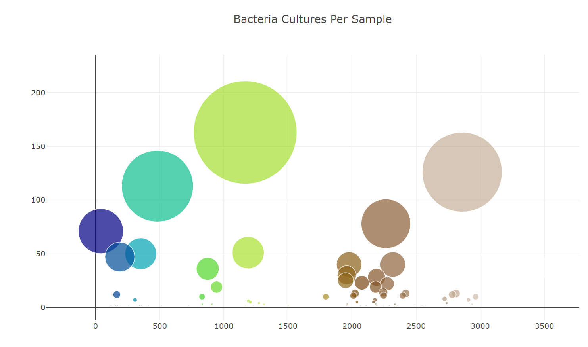

# belly-button-challenge

Interactive Dashboard for Belly Button Biodiversity README

Overview
This interactive dashboard explores the Belly Button Biodiversity dataset, showcasing the variety of microbes found in human navels. It highlights how a few microbial species are common across individuals, while many are rare.

Features
Dropdown Menu: Users can select different individuals from the dataset to view their microbial data.

Bar Chart: Displays the top 10 microbial species (OTUs) found in the selected individual.
Bubble Chart: Visualizes the frequency of all microbes in the selected sample, with different sizes and colors representing the abundance and type of microbe.
Demographic Information: Shows detailed demographic data about the selected individual.

How to Use
Select a Sample: Use the dropdown menu to choose an individual's sample data.
View Visualizations: Observe the updated bar and bubble charts reflecting the selected individual's microbial data.
Read Metadata: Check the panel displaying the individual's demographic information.

Behind the Scenes
The dashboard utilizes D3.js for fetching and handling the dataset, Plotly.js for creating dynamic visualizations, and basic HTML/CSS for the layout and design. When a new individual is selected from the dropdown, the visualizations and metadata information automatically update to reflect the new data.

Getting Started
To get started with the dashboard, simply load the index.html file in a web browser. The data and visualizations will load automatically, ready for exploration.

Check out the live demo <[here](https://JonnyHaas.github.io/repository/)>.

I used ChatGPT to help me write the code to successfully complete the project.
Below are snippit's of the plots produced in the index.html.

I was not able to get GitHub Pages to work!  My understanding is my files need to be in the "Main" Root Directory.  I simply ran out of time to complete the task by Challenge due time.  
